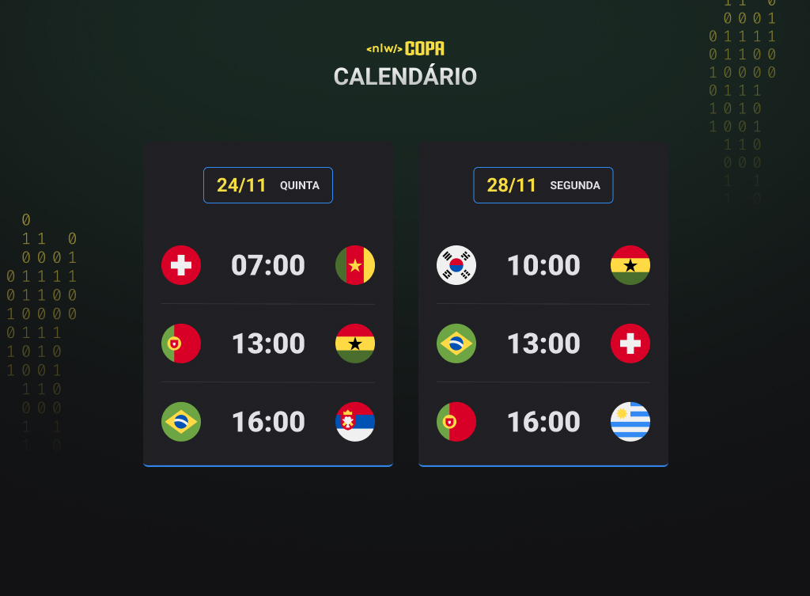

<h1 align="center"> NLW Copa</h1>

Evento exclusivo e gratuito, promovido pela Rocketseat para ensino de tecnologia WEB.

  <a href="#-tecnologias">Tecnologias</a>&nbsp;&nbsp;&nbsp;|&nbsp;&nbsp;&nbsp;
  <a href="#-projeto">Projeto</a>&nbsp;&nbsp;&nbsp;|&nbsp;&nbsp;&nbsp;
  <a href="#-layout">Layout</a>

  

 

  

## 🚀 ​Tecnologias

Esse projeto foi desenvolvido com as seguintes tecnologias:

- HTML e CSS
- JavaScript
- Git e Github

## 💻​ Projeto

O Calendário da Copa é um projeto que mostra os jogos da copa de 2022.

## 📑​ Layout

Você pode visualizar o layout do projeto através [DESSE LINK](https://www.figma.com/file/UDpShT5uXDU7pyyyqHWjYI/Calendário-de-Jogos-(Community)/duplicate). É necessário ter uma conta no [Figma](https://figma.com) para acessá-lo. 

## :memo: Licença

Esse projeto está sob a licença MIT